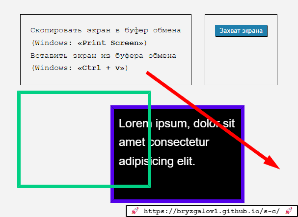
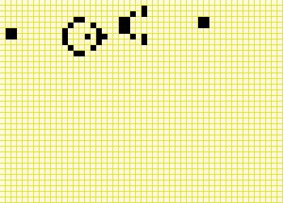
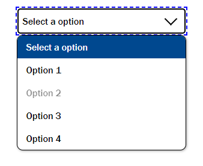

-   👋 Привет, я Дмитрий
-   👀 Я Frontend разработчик
-   📫 Чтобы связаться со мной, пишите на bryzgalovd@gmail.com

<!---
bryzgalov1/bryzgalov1 is a ✨ special ✨ repository because its `README.md` (this file) appears on your GitHub profile.
You can click the Preview link to take a look at your changes.
--->

-   [screen-capture](https://bryzgalov1.github.io/s-c/): Простой инструмент сделать и поделиться скриншотом.   

-   [game-of-life](https://bryzgalov1.github.io/game-of-life/#?key=glidergun2&mode=play&width=50&height=36&grain=8&grid=true&data=0-0-1048576-20-0-404226144-2182-1572888-68255744-393494-335544320-4260096-8-2147483648-98304-0-0-0-0-0-0-0-0-0-0-0-0-0-0-0-0-0-0-0-0-0-0-0-0-0-0-0-0-0-0-0-0-0-0-0-0-0-0-0-0-0--00000000): Игра Жизнь.   

-   [zSelect](https://github.com/bryzgalov1/zselect): Headless Select Box Replacement.   
